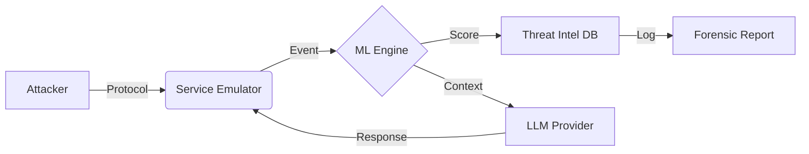

<div align="center">

# N E X U S
### AI-NATIVE DECEPTION ENVIRONMENT

<p align="center">
  
  
  
  
</p>

</div>

---

<div align="center">

| [ QUICK START ](#-quick-start) | [ ARCHITECTURE ](#-system-architecture) | [ PROTOCOLS ](#-service-protocols) | [ CLI MANUAL ](#-cli-reference) | [ CONFIGURATION ](#-configuration) |
| :---: | :---: | :---: | :---: | :---: |

</div>

---

## /// SYSTEM_OVERVIEW

**NEXUS** is not just a honeypot; it is a **high-fidelity deception ecosystem** engineered for proactive threat intelligence. Unlike static emulation, NEXUS leverages advanced Large Language Models (LLMs) and real-time Machine Learning algorithms to generate dynamic, context-aware responses that adapt to attacker behavior.

This platform automates the entire deception lifecycle: **Simulation > Detection > Analysis > Reporting**.

### [ CORE CAPABILITIES ]

<table style="width:100%; border-collapse: collapse; border: 1px solid #000;">
  <tr style="background-color: #000; color: #fff;">
    <th style="padding: 10px; text-align: left; border: 1px solid #fff;">MODULE</th>
    <th style="padding: 10px; text-align: left; border: 1px solid #fff;">INTELLIGENCE ENGINE</th>
    <th style="padding: 10px; text-align: left; border: 1px solid #fff;">CAPABILITIES</th>
  </tr>
  <tr>
    <td style="padding: 10px; border: 1px solid #000;"><strong>SSH EMULATOR</strong></td>
    <td style="padding: 10px; border: 1px solid #000;"><code>asyncssh</code> + GPT-4o</td>
    <td style="padding: 10px; border: 1px solid #000;">Full TTY Simulation, Command Analysis, Real-time Anomaly Scoring</td>
  </tr>
  <tr>
    <td style="padding: 10px; border: 1px solid #000;"><strong>HTTP SERVER</strong></td>
    <td style="padding: 10px; border: 1px solid #000;"><code>aiohttp</code> + Gemini 1.5</td>
    <td style="padding: 10px; border: 1px solid #000;">Dynamic Web Content, SQLi/XSS Detection, Path Traversal Analysis</td>
  </tr>
  <tr>
    <td style="padding: 10px; border: 1px solid #000;"><strong>MYSQL DATABASE</strong></td>
    <td style="padding: 10px; border: 1px solid #000;"><code>mysql-mimic</code> + Claude 3.5</td>
    <td style="padding: 10px; border: 1px solid #000;">Protocol-compliant Auth, Query Parsing, Threat Classification</td>
  </tr>
  <tr>
    <td style="padding: 10px; border: 1px solid #000;"><strong>FTP SERVER</strong></td>
    <td style="padding: 10px; border: 1px solid #000;"><code>pyftpdlib</code> + Ollama</td>
    <td style="padding: 10px; border: 1px solid #000;">File System Emulation, Upload Analysis, Bounce Attack Detection</td>
  </tr>
</table>

<br>

## /// SYSTEM_ARCHITECTURE

The NEXUS architecture is built on a modular, asynchronous event loop powered by `asyncio`. It decouples protocol handling from the intelligence layer, allowing for high-concurrency processing of 1000+ simultaneous connections.

### 1. ML THREAT DETECTION MATRIX
Real-time analysis using 6 distinct algorithms:
*   `Isolation Forest`: Outlier detection in command streams.
*   `One-Class SVM`: Non-linear anomaly boundaries.
*   `LOF`: Local density deviation.
*   `HDBSCAN`: Hierarchical clustering of attack sessions.
*   `K-Means`: Centroid-based pattern grouping.
*   `XGBoost`: Gradient boosting for supervised threat classification.

### 2. DATA PIPELINE


---

## /// INSTALLATION_SETUP

### [ PREREQUISITES ]

| COMPONENT | REQUIREMENT | PURPOSE |
| :--- | :--- | :--- |
| **OS** | Linux / Windows / macOS | Hosting Environment |
| **Python** | v3.8+ | Core Runtime |
| **Docker** | v20.10+ (Optional) | Containerization |
| **LLM Key** | OpenAI / Gemini / Anthropic | Cognitive Engine |

### [ DEPLOYMENT ]

1. **CLONE REPOSITORY**
   ```bash
   git clone https://github.com/PROFFARO/nexus-development.git
   cd nexus-development
   ```

2. **INITIALIZE ENVIRONMENT**
   ```bash
   python -m venv .venv
   source .venv/bin/activate  # Windows: .venv\Scripts\activate
   pip install -r requirements.txt
   ```

3. **CONFIGURE SECRETS**
   ```bash
   cp src/service_emulators/SSH/.env.example src/service_emulators/SSH/.env
   # Edit .env and add your OPENAI_API_KEY
   ```

---

## /// CLI_REFERENCE

The `nexus_cli.py` is the central command and control interface for the platform.

### [ PRIMARY COMMANDS ]

| COMMAND | ARGUMENTS | DESCRIPTION |
| :--- | :--- | :--- |
| `start-all` | `--llm-provider` | Ignite all service emulators simultaneously. |
| `ssh` | `--port`, `--llm-provider` | Launch the SSH honeypot module. |
| `http` | `--port`, `--ssl` | Launch the HTTP/Web honeypot module. |
| `mysql` | `--port`, `--config` | Launch the MySQL database honeypot. |
| `ftp` | `--port`, `--user-account` | Launch the FTP file server honeypot. |
| `ml` | `train`, `predict`, `eval` | Manage Machine Learning models. |
| `report` | `--format`, `--severity` | Generate forensic analysis reports. |

### [ USAGE EXAMPLES ]

**LAUNCH SSH HONEYPOT**
```bash
python src/cli/nexus_cli.py ssh --port 2222 --llm-provider openai --model-name gpt-4o
```

**ANALYZE LOGS WITH ML**
```bash
python src/cli/nexus_cli.py logs ssh --ml-analysis --ml-insights --anomaly-threshold 0.8
```

**TRAIN ANOMALY MODELS**
```bash
python src/cli/nexus_cli.py ml train ssh --algorithm isolation_forest
```

---

## /// CONFIGURATION

Configuration is handled via tiered `.ini` files and environment variables.

<details>
<summary style="cursor: pointer; padding: 10px; background-color: #000; color: #fff; border: 1px solid #333;"><strong>[ CLICK TO EXPAND ] SSH CONFIGURATION (ssh_config.ini)</strong></summary>

```ini
[ssh]
listen_port = 8022
host_key_file = host.key
version_string = OpenSSH_8.2p1 Ubuntu-4ubuntu0.5
banner_file = banner.txt

[auth]
allow_any_password = true
max_attempts = 3

[llm]
provider = openai
model = gpt-4o
temperature = 0.1
max_tokens = 1000
system_prompt = You are a Ubuntu 20.04 LTS terminal. Respond only with the output of the command.
```
</details>

<details>
<summary style="cursor: pointer; padding: 10px; background-color: #000; color: #fff; border: 1px solid #333; margin-top: 5px;"><strong>[ CLICK TO EXPAND ] MYSQL CONFIGURATION (mysql_config.ini)</strong></summary>

```ini
[mysql]
listen_port = 3306
server_version = 8.0.32

[users]
root = toor
admin = password123
metrics = secret

[behavior]
simulate_delay = true
delay_range = 0.01, 0.1
```
</details>

---

## /// CONTRIBUTING

**NEXUS** is an open-research project. We welcome contributions that advance the field of deception technology.

1.  **FORK** the repository.
2.  **CREATE** a feature branch (`git checkout -b feature/atomic-reactor`).
3.  **COMMIT** your changes with clear messages.
4.  **PUSH** to the branch.
5.  **OPEN** a Pull Request.

<div align="center" style="margin-top: 50px;">
  <p style="font-size: 10px; color: #666;">
    ENGINEERED BY PROFFARO | ADVANCED AGENTIC CODING
  </p>
</div>