<div align="center">
<a name="top"></a>

# 🛡️ NEXUS AI-Enhanced Honeypot System

### *Advanced Multi-Protocol Threat Intelligence Platform*

[](LICENSE)
[](https://python.org)
[](https://nextjs.org)
[](#llm-integration)


**An AI-powered honeypot platform combining machine learning threat detection with LLM-driven adaptive responses across SSH, FTP, and MySQL protocols.**

[Quick Start](#-quick-start) • [Architecture](#-system-architecture) • [ML Models](#-machine-learning-pipeline) • [Services](#-service-emulators) • [API](#-api-reference) • [Dashboard](#-web-dashboard)

</div>

---

## 📑 Table of Contents

- [Overview](#-overview)
- [Key Features](#-key-features)
- [Quick Start](#-quick-start)
- [System Architecture](#-system-architecture)
- [Machine Learning Pipeline](#-machine-learning-pipeline)
- [Service Emulators](#-service-emulators)
- [Datasets](#-datasets)
- [Configuration](#-configuration)
- [CLI Reference](#-cli-reference)
- [API Reference](#-api-reference)
- [Web Dashboard](#-web-dashboard)
- [Author](#-author)
- [License](#-license)

---

## 🎯 Overview

NEXUS is a next-generation honeypot system that leverages **artificial intelligence** and **large language models** to create highly realistic service emulations. Unlike traditional honeypots with static responses, NEXUS generates dynamic, context-aware interactions that adapt to attacker behavior in real-time.

```mermaid
graph TB
    subgraph Attackers
        A1[🔴 Attacker 1]
        A2[🔴 Attacker 2]
        A3[🔴 Attacker N]
    end
    
    subgraph NEXUS["🛡️ NEXUS Platform"]
        SSH[SSH Honeypot<br/>Port 22/8022]
        FTP[FTP Honeypot<br/>Port 21/2121]
        MySQL[MySQL Honeypot<br/>Port 3306/3307]
        
        subgraph AI["🧠 AI Engine"]
            ML[ML Detector]
            LLM[LLM Response Generator]
            EMB[Embedding Similarity]
        end
        
        subgraph Storage["💾 Data Layer"]
            VFS[Virtual Filesystem]
            VDB[Virtual Database]
            LOGS[Session Logs]
        end
    end
    
    subgraph Analysis["📊 Analysis"]
        API[REST API]
        WEB[Web Dashboard]
        REPORTS[Security Reports]
    end
    
    A1 --> SSH
    A2 --> FTP
    A3 --> MySQL
    
    SSH --> AI
    FTP --> AI
    MySQL --> AI
    
    AI --> Storage
    Storage --> API
    API --> WEB
    API --> REPORTS
```



---

## ✨ Key Features

| Category | Features |
|----------|----------|
| **🤖 AI-Powered** | LLM-driven responses (OpenAI, Azure, Ollama, Gemini, AWS Bedrock) |
| **🔬 ML Detection** | Real-time anomaly detection with Isolation Forest, HDBSCAN, SVM |
| **🌐 Multi-Protocol** | SSH, FTP, MySQL protocol emulation with realistic filesystems |
| **📊 Analytics** | Real-time dashboard, attack visualization, security reports |
| **🔒 Security** | Prompt injection protection, rate limiting, IP reputation |
| **📝 Forensics** | Complete session recording, chain of custody, file capture |

---

## 🚀 Quick Start

### Prerequisites

- **Python 3.10+**
- **Node.js 18+** (for web dashboard)
- **LLM Provider** (Ollama recommended for local deployment)

### Installation

```bash
# 1. Clone the repository
git clone https://github.com/PROFFARO/nexus.git
cd nexus

# 2. Create virtual environment
python -m venv venv
source venv/bin/activate  # Windows: venv\Scripts\activate

# 3. Install dependencies
pip install -r requirements.txt

# 4. Configure environment
cp configs/ssh_config.ini src/service_emulators/SSH/config.ini
cp configs/ftp_config.ini src/service_emulators/FTP/config.ini
cp configs/mysql_config.ini src/service_emulators/MySQL/config.ini

# 5. Setup LLM provider (example: Ollama)
# Install Ollama from https://ollama.ai
ollama pull llama3.2

# 6. Train ML models
python train_service-ml.py --service all --verbose

# 7. Start services
python -m src.cli.nexus_cli start-all
```

### Quick Test

```bash
# Test SSH honeypot
ssh root@localhost -p 8022

# Test FTP honeypot
ftp localhost 2121

# Test MySQL honeypot
mysql -h 127.0.0.1 -P 3307 -u root -p
```

---

## 🏗️ System Architecture

### Project Structure

```
nexus/
├── 📂 configs/                    # Global configuration files
│   ├── ftp_config.ini
│   ├── mysql_config.ini
│   └── ssh_config.ini
├── 📂 datasets/                   # Training datasets (63 files, ~2GB)
├── 📂 models/                     # Trained ML models
│   ├── ftp/                       # FTP-specific models
│   ├── mysql/                     # MySQL-specific models
│   └── ssh/                       # SSH-specific models
├── 📂 src/
│   ├── 📂 ai/                     # ML/AI core modules
│   │   ├── config.py              # ML configuration
│   │   ├── data_processor.py      # Dataset loading & preprocessing
│   │   ├── detectors.py           # Anomaly & threat detection
│   │   ├── embeddings.py          # FAISS similarity search
│   │   ├── features.py            # Feature extraction
│   │   ├── ml_logger.py           # Verbose ML logging
│   │   └── training.py            # Model training pipeline
│   ├── 📂 api/                    # FastAPI backend
│   │   ├── main.py                # API entry point
│   │   ├── routes.py              # WebSocket endpoints
│   │   └── ml_routes.py           # ML analysis endpoints
│   ├── 📂 cli/                    # Command-line interface
│   │   └── nexus_cli.py           # Unified CLI (1800+ lines)
│   ├── 📂 logs/                   # Centralized logging
│   │   └── log_viewer.py          # Log analysis tools
│   ├── 📂 service_emulators/      # Protocol implementations
│   │   ├── 📂 FTP/
│   │   ├── 📂 MySQL/
│   │   └── 📂 SSH/
│   └── 📂 web/                    # Next.js dashboard
├── 📄 train_service-ml.py         # ML training script
└── 📄 requirements.txt            # Python dependencies
```

### Component Interaction Flow


---

## 🧠 Machine Learning Pipeline

### Algorithm Overview

NEXUS employs a **multi-model ensemble** approach for comprehensive threat detection:


### Algorithms Deep Dive

#### 1. Isolation Forest (Anomaly Detection)

**Mathematical Foundation:**

Isolation Forest exploits the property that anomalies are "few and different" - they are more susceptible to isolation.

$$\text{Anomaly Score} = 2^{-\frac{E(h(x))}{c(n)}}$$

Where:
- $E(h(x))$ = average path length to isolate point $x$
- $c(n)$ = average path length in unsuccessful search in BST
- $c(n) = 2H(n-1) - \frac{2(n-1)}{n}$, where $H(i) = \ln(i) + \gamma$ (Euler's constant)

**Implementation:**
```python
# src/ai/training.py
def _train_isolation_forest(self, X: np.ndarray):
    model = IsolationForest(
        n_estimators=100,       # Number of isolation trees
        contamination=0.1,      # Expected anomaly fraction
        max_samples='auto',     # Samples per tree
        random_state=42
    )
    model.fit(X)
    return model
```

| Parameter | Value | Rationale |
|-----------|-------|-----------|
| `n_estimators` | 100 | Balance between accuracy and speed |
| `contamination` | 0.1 | ~10% expected attack traffic |
| `max_samples` | auto | $\min(256, n_{samples})$ for efficiency |

---

#### 2. One-Class SVM (Novelty Detection)

**Mathematical Foundation:**

One-Class SVM learns a decision boundary in feature space using the kernel trick:

$$\min_{w,\xi,\rho} \frac{1}{2}||w||^2 + \frac{1}{\nu n}\sum_{i=1}^{n}\xi_i - \rho$$

Subject to: $w \cdot \Phi(x_i) \geq \rho - \xi_i$, $\xi_i \geq 0$

Using RBF kernel: $K(x,x') = \exp(-\gamma||x-x'||^2)$

**Implementation:**
```python
def _train_one_class_svm(self, X: np.ndarray):
    model = OneClassSVM(
        kernel='rbf',           # Radial Basis Function
        nu=0.1,                 # Upper bound on anomaly fraction
        gamma='scale'           # 1/(n_features * X.var())
    )
    model.fit(X)
    return model
```

---

#### 3. HDBSCAN (Hierarchical Density-Based Clustering)

**Mathematical Foundation:**

HDBSCAN extends DBSCAN with hierarchical clustering to find clusters of varying densities:

1. **Core Distance:** $d_{core}(x) = d(x, x^{(k)})$ (distance to k-th nearest neighbor)

2. **Mutual Reachability Distance:**
$$d_{mreach}(a,b) = \max(d_{core}(a), d_{core}(b), d(a,b))$$

3. **Cluster Stability:**
$$S(C) = \sum_{x \in C}(\lambda_{max}(x,C) - \lambda_{min}(C))$$

**Implementation:**
```python
def _train_hdbscan(self, X: np.ndarray):
    model = hdbscan.HDBSCAN(
        min_cluster_size=5,         # Minimum points per cluster
        min_samples=3,              # Core point density
        cluster_selection_epsilon=0.5,
        metric='euclidean'
    )
    model.fit(X)
    return model
```

---

#### 4. FAISS Similarity Search

**Mathematical Foundation:**

FAISS enables fast approximate nearest neighbor search using:

- **L2 Distance:** $d(x,y) = ||x-y||_2$
- **Inner Product:** $s(x,y) = x \cdot y$

Uses **IVF (Inverted File) Index** with product quantization for billion-scale search.

**Implementation:**
```python
# src/ai/embeddings.py
def build_faiss_index(self, texts: List[str]):
    embeddings = self.encode_batch(texts)
    dimension = embeddings.shape[1]  # 384 for MiniLM
    
    index = faiss.IndexFlatL2(dimension)
    index.add(embeddings.astype('float32'))
    return index
```

---

### Model Artifacts

Each service generates 9 model files:

| File | Size (SSH) | Purpose |
|------|------------|---------|
| `embeddings.cache` | 28MB | Cached sentence embeddings |
| `faiss.index` | 130MB | Similarity search index |
| `hdbscan_clustering.pkl` | 7.5MB | Behavior clustering model |
| `isolation_forest_anomaly.pkl` | 60KB | Anomaly detection model |
| `one_class_svm_anomaly.pkl` | 223KB | Novelty detection model |
| `supervised_classifier.pkl` | 73KB | Attack classification model |
| `scaler.pkl` | 129B | Feature normalization |
| `label_encoder.pkl` | 399B | Label encoding |
| `vectorizer.pkl` | 457B | TF-IDF vectorizer |

---

### Training Pipeline

```bash
# Train all services with verbose output
python train_service-ml.py --service all --verbose 2

# Train specific service
python train_service-ml.py --service ssh --algorithms isolation_forest,hdbscan

# Available algorithms
# - isolation_forest  : Anomaly detection
# - one_class_svm     : Novelty detection
# - hdbscan           : Density clustering
# - dbscan            : Density clustering
# - kmeans            : Centroid clustering
# - xgboost           : Supervised classification
```

### Metric Evaluation

| Metric | Formula | Target |
|--------|---------|--------|
| **Precision** | $\frac{TP}{TP+FP}$ | > 0.85 |
| **Recall** | $\frac{TP}{TP+FN}$ | > 0.90 |
| **F1 Score** | $2 \cdot \frac{P \cdot R}{P+R}$ | > 0.87 |
| **Silhouette** | $\frac{b-a}{\max(a,b)}$ | > 0.5 |

---

## 🔌 Service Emulators

### Architecture Pattern

All services follow a **3-Layer Command Dispatch** pattern:


---

### SSH Honeypot

**Location:** `src/service_emulators/SSH/`

| Component | File | Lines | Purpose |
|-----------|------|-------|---------|
| Server | `ssh_server.py` | 3,294 | AsyncSSH protocol handler |
| Executor | `command_executor.py` | 6,287 | Command routing & execution |
| Filesystem | `virtual_filesystem.py` | 1,071 | Ubuntu 20.04 LTS emulation |
| LLM Guard | `llm_guard.py` | 343 | Injection protection |
| Reports | `report_generator.py` | - | HTML security reports |

**Supported Commands (100+):**

```
File Operations    : ls, cat, head, tail, less, more, find, grep, cp, mv, rm
Directory         : cd, pwd, mkdir, rmdir, tree
System Info       : uname, hostname, whoami, id, uptime, ps, top, df, du
Network           : netstat, ss, ip, ifconfig, ping, curl, wget
Package           : apt, apt-get, dpkg (simulated)
Text Processing   : awk, sed, cut, sort, uniq, wc
Archives          : tar, gzip, zip, unzip
Permissions       : chmod, chown, chgrp
```

**Virtual Filesystem Structure:**

```
/
├── bin/          # Essential binaries
├── etc/          # Configuration files (passwd, shadow, hosts, ssh/)
├── home/         # User directories with game development content
├── opt/games/    # NexusGames Studio projects
├── srv/          # Game assets and builds
├── tmp/          # Temporary files
├── var/          # Logs and build artifacts
└── backup/       # "Misconfigured" database backups (honeypot)
```

---

### FTP Honeypot

**Location:** `src/service_emulators/FTP/`

| Component | File | Lines | Purpose |
|-----------|------|-------|---------|
| Server | `ftp_server.py` | 2,800 | Async FTP protocol handler |
| Executor | `command_executor.py` | 1,245 | 3-layer command dispatch |
| Filesystem | `virtual_filesystem.py` | 1,314 | FTP-specific VFS |
| LLM Guard | `llm_guard.py` | 501 | FTP response validation |

**FTP Command Support:**

| Category | Commands |
|----------|----------|
| Authentication | `USER`, `PASS`, `QUIT` |
| Navigation | `PWD`, `CWD`, `CDUP` |
| Listing | `LIST`, `NLST`, `MLST`, `MLSD` |
| Transfer | `RETR`, `STOR`, `APPE` |
| File Ops | `DELE`, `RMD`, `MKD`, `RNFR`, `RNTO` |
| Info | `SIZE`, `MDTM`, `STAT`, `FEAT`, `HELP` |
| Transfer Mode | `TYPE`, `MODE`, `STRU`, `PASV`, `PORT` |

---

### MySQL Honeypot

**Location:** `src/service_emulators/MySQL/`

| Component | File | Lines | Purpose |
|-----------|------|-------|---------|
| Server | `mysql_server.py` | 3,764 | mysql_mimic protocol |
| Executor | `mysql_command_executor.py` | 1,644 | 50+ SQL command handlers |
| Database | `mysql_database.py` | 1,915 | Virtual database system |
| LLM Guard | `mysql_llm_guard.py` | 654 | SQL injection detection |

**SQL Command Support:**

```sql
-- Metadata Commands
SHOW DATABASES, SHOW TABLES, SHOW COLUMNS, SHOW CREATE TABLE
SHOW VARIABLES, SHOW STATUS, SHOW PROCESSLIST, SHOW GRANTS

-- DDL
CREATE DATABASE, CREATE TABLE, DROP TABLE, ALTER TABLE

-- DML
SELECT, INSERT, UPDATE, DELETE, TRUNCATE

-- System
USE, SET, DESCRIBE, EXPLAIN
```

**Virtual Database Schema (Gaming Industry):**

```
nexus_games/
├── users           (id, username, email, password_hash, created_at)
├── characters      (id, user_id, name, class, level, experience)
├── inventory       (id, character_id, item_type, item_name, quantity)
├── transactions    (id, user_id, amount, currency, timestamp)
├── game_sessions   (id, user_id, start_time, end_time, score)
└── achievements    (id, character_id, achievement_name, unlocked_at)
```

---

## 📊 Datasets

### Overview

NEXUS includes **63 datasets** (~2GB) for training ML models:


### CICIDS2017 Network Intrusion Dataset

| File | Size | Attack Types |
|------|------|--------------|
| `Monday-WorkingHours.pcap_ISCX.csv` | 268MB | Benign traffic |
| `Tuesday-WorkingHours.pcap_ISCX.csv` | 174MB | FTP-Patator, SSH-Patator |
| `Wednesday-workingHours.pcap_ISCX.csv` | 285MB | DoS, Heartbleed |
| `Thursday-Morning-WebAttacks.pcap_ISCX.csv` | 92MB | Web attacks, XSS, SQL Injection |
| `Thursday-Afternoon-Infilteration.pcap_ISCX.csv` | 108MB | Infiltration |
| `Friday-Morning.pcap_ISCX.csv` | 75MB | Botnet |
| `Friday-Afternoon-DDos.pcap_ISCX.csv` | 96MB | DDoS |
| `Friday-Afternoon-PortScan.pcap_ISCX.csv` | 101MB | Port Scan |

**Features (80+):** Flow duration, packet counts, byte counts, flags, IAT statistics, etc.

### Cowrie SSH Honeypot Logs

16 JSON log files from Nov 2022 deployment:

```json
{
  "eventid": "cowrie.command.input",
  "session": "abc123",
  "timestamp": "2022-11-14T10:30:45.123456Z",
  "src_ip": "192.168.1.100",
  "input": "cat /etc/passwd",
  "success": true
}
```

### Additional Datasets

| Dataset | Size | Description |
|---------|------|-------------|
| `brute_force_data.json` | 4.8MB | Login attempt patterns |
| `ssh_anomaly_dataset.csv` | 3.5MB | Labeled SSH anomalies |
| `cve.csv` | 39MB | CVE vulnerability database |
| `dionaeaClean2.csv` | 2MB | Dionaea honeypot captures |

---

## ⚙️ Configuration

### Configuration Files

| File | Location | Purpose |
|------|----------|---------|
| `ssh_config.ini` | `configs/` | SSH honeypot settings |
| `ftp_config.ini` | `configs/` | FTP honeypot settings |
| `mysql_config.ini` | `configs/` | MySQL honeypot settings |

### Key Configuration Sections

#### `[honeypot]` - General Settings

```ini
log_file = ../../logs/ssh_log.log
sensor_name = nexus-ssh-honeypot
sessions_dir = sessions
attack_logging = true
behavioral_analysis = true
forensic_chain = true
adaptive_responses = true
```

#### `[llm]` - LLM Provider Configuration

```ini
# OpenAI
llm_provider = openai
model_name = gpt-4o

# Azure OpenAI
llm_provider = azure
azure_deployment = gpt-4o
azure_endpoint = https://your-endpoint.openai.azure.com

# Ollama (Local)
llm_provider = ollama
model_name = llama3.2
base_url = http://localhost:11434

# AWS Bedrock
llm_provider = AWS
model_name = anthropic.claude-3-5-sonnet-20240620-v1:0
aws_region = us-east-1

# Google Gemini
llm_provider = gemini
model_name = gemini-2.5-flash

# Common settings
temperature = 0.2
max_response_tokens = 2048
context_awareness = true
```

#### `[ml]` - Machine Learning Settings

```ini
enabled = true
anomaly_threshold = 0.95
max_inference_ms = 15
fallback_on_error = true
embedding_model = sentence-transformers/all-MiniLM-L6-v2
batch_size = 32
cache_embeddings = true
```

#### `[security]` - Rate Limiting & Protection

```ini
rate_limiting = true
max_connections_per_ip = 5
connection_timeout = 300
intrusion_detection = true
automated_blocking = false
```

---

## 💻 CLI Reference

### Command Structure

```bash
python -m src.cli.nexus_cli <command> [options]
```

### Available Commands

| Command | Description |
|---------|-------------|
| `start-all` | Start all honeypot services |
| `stop-all` | Stop all running services |
| `status` | Show service status |
| `ssh` | Start SSH honeypot |
| `ftp` | Start FTP honeypot |
| `mysql` | Start MySQL honeypot |
| `report` | Generate security reports |
| `logs` | View and analyze logs |
| `ml` | ML operations (train, eval, predict) |

### ML Subcommands

```bash
# Extract features from datasets
python -m src.cli.nexus_cli ml extract --service ssh --verbose

# Train models
python -m src.cli.nexus_cli ml train --service all --algorithms isolation_forest,hdbscan

# Evaluate models
python -m src.cli.nexus_cli ml eval --service ssh

# Make predictions
python -m src.cli.nexus_cli ml predict --service ssh --input "cat /etc/shadow"

# Update models with new data
python -m src.cli.nexus_cli ml update-models --service all
```

### Service Start Examples

```bash
# Start SSH on custom port
python -m src.cli.nexus_cli ssh --port 2222 --host 0.0.0.0

# Start FTP with specific config
python -m src.cli.nexus_cli ftp --config /path/to/config.ini

# Generate HTML report for SSH
python -m src.cli.nexus_cli report --service ssh --format html --output report.html
```

---

## 🌐 API Reference

### Base URL

```
http://localhost:8000/api/v1
```

### Endpoints

#### WebSocket - Real-Time Attacks

```
WS /ws/attacks
```

Streams attack events in real-time:

```json
{
  "event_type": "attack",
  "service": "ssh",
  "session_id": "abc123",
  "timestamp": "2024-01-15T10:30:00Z",
  "command": "cat /etc/shadow",
  "ml_score": 0.87,
  "attack_types": ["credential_access", "privilege_escalation"]
}
```

#### GET /ml/stats

Returns aggregated ML statistics:

```json
{
  "total_sessions": 150,
  "total_commands": 3420,
  "total_attacks": 234,
  "avg_anomaly_score": 0.42,
  "high_risk_count": 45,
  "medium_risk_count": 89,
  "low_risk_count": 100
}
```

#### GET /ml/sessions

List all analyzed sessions with ML metrics.

#### GET /ml/sessions/{session_id}

Get detailed ML analysis for a specific session.

#### GET /ml/attacks

List detected attacks with filters:

```bash
GET /ml/attacks?service=ssh&severity=high&min_score=0.8&limit=50
```

#### GET /services/active

Check which services are currently running.

---

## 📈 Web Dashboard

### Technology Stack

| Technology | Version | Purpose |
|------------|---------|---------|
| Next.js | 15 | React framework |
| TypeScript | 5 | Type safety |
| Tailwind CSS | 3.4 | Styling |
| shadcn/ui | - | UI components |
| Recharts | - | Data visualization |
| Framer Motion | - | Animations |

### Setup

```bash
cd src/web

# Install dependencies
npm install

# Development server
npm run dev

# Production build
npm run build
npm start
```

**Or use the CLI (recommended):**

```bash
# Start web dashboard directly
python -m src.cli.nexus_cli web

# With custom port
python -m src.cli.nexus_cli web --port 3001

# Install dependencies and start
python -m src.cli.nexus_cli web --install

# Production mode
python -m src.cli.nexus_cli web --build --prod
```

### Environment Configuration

**Step 1:** Copy the example environment file:

```bash
cd src/web
cp .env.example .env.local
```

**Step 2:** Edit `.env.local` and configure your API keys:

```ini
# FastAPI Backend URL
NEXT_PUBLIC_API_URL=http://localhost:8000

# LLM Provider Configuration
# Choose one provider and set the corresponding API key

# Option 1: Google Gemini (Recommended)
LLM_PROVIDER=gemini
GOOGLE_API_KEY=your_google_api_key_here

# Option 2: OpenAI
# LLM_PROVIDER=openai
# OPENAI_API_KEY=sk-your-openai-key-here

# Option 3: Azure OpenAI
# LLM_PROVIDER=azure
# AZURE_OPENAI_API_KEY=your-azure-key
# AZURE_OPENAI_ENDPOINT=https://your-resource.openai.azure.com
# AZURE_OPENAI_DEPLOYMENT=gpt-4o
```

### Get API Keys

| Provider | Link | Free Tier |
|----------|------|-----------|
| **Google Gemini** | [Get API Key →](https://aistudio.google.com/app/apikey) | ✅ Free tier available |
| **OpenAI** | [Get API Key →](https://platform.openai.com/api-keys) | ❌ Pay-as-you-go |
| **Azure OpenAI** | [Apply for Access →](https://azure.microsoft.com/en-us/products/ai-services/openai-service) | ❌ Requires Azure subscription |
| **Ollama (Local)** | [Download →](https://ollama.ai/download) | ✅ Free (runs locally) |

> 💡 **Tip:** For local development without API costs, use **Ollama** with a local LLM like `llama3.2`.

### Dashboard Features

- **Real-time Attack Feed** - Live WebSocket updates
- **Session Explorer** - Detailed session analysis
- **ML Metrics** - Anomaly scores and risk levels
- **Service Status** - Health monitoring
- **Attack Visualization** - Charts and heatmaps
- **Report Generation** - Export security reports

---

## 🔐 LLM Integration

### Prompt Injection Protection

The `LLMGuard` class implements multi-layer protection:

```python
INJECTION_PATTERNS = [
    r"ignore\s+(previous|all|the)\s+(instructions?|prompts?)",
    r"you\s+are\s+(now|actually)\s+",
    r"pretend\s+(to\s+be|you're)",
    r"jailbreak",
    r"DAN\s+mode",
    # ... 50+ patterns
]
```

### Response Validation

1. **Input Validation** - Sanitize commands before LLM
2. **Context Enhancement** - Add filesystem state to prompts
3. **Output Validation** - Check for hallucinations
4. **Meta-commentary Removal** - Strip AI explanations

---

## 👤 Author

<div align="center">

**PROFFARO - NEXUS Development Team**

[](https://github.com/PROFFARO)

*AI-Enhanced Cybersecurity Research & Development*

</div>

---

## 📜 License

This project is licensed under the **MIT License** with additional terms for honeypot software.

```
MIT License

Copyright (c) 2024 PROFFARO - NEXUS Development Team

Permission is hereby granted, free of charge, to any person obtaining a copy
of this software and associated documentation files (the "Software"), to deal
in the Software without restriction...
```

**Additional Terms:**
- ✅ Educational and research use encouraged
- ✅ Responsible disclosure required
- ⚠️ Legal compliance required in your jurisdiction
- ❌ No malicious use permitted

See [LICENSE](LICENSE) for complete terms.

---

<div align="center">

**[⬆ Back to Top](#top)**

Made with 💜 by PROFFARO

</div>
